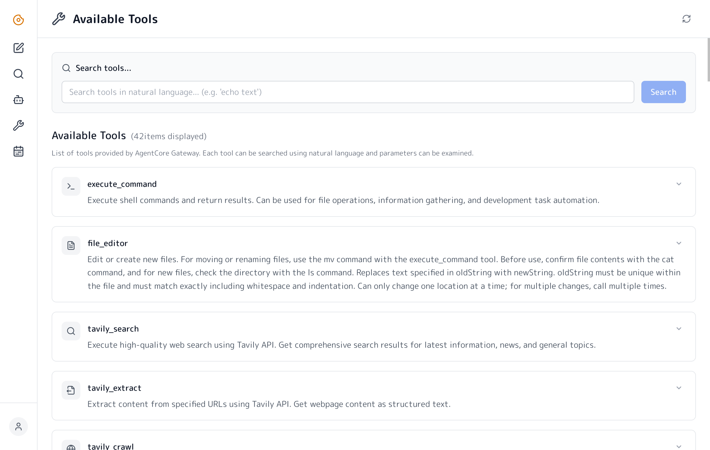
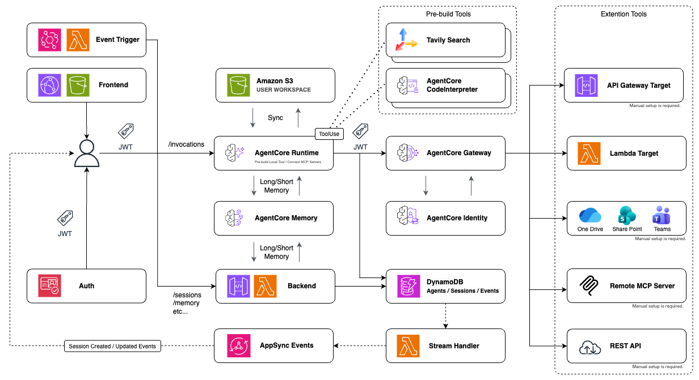

Language: [English](./README.md) / [Japanese](./README-ja.md)

# Donuts

Amazon Bedrock AgentCore を基盤とした AI エージェントプラットフォームです。

## 概要

Donutsは、チームが AI エージェントを**自由に作成・カスタマイズ**し、組織全体で共有できるマルチエージェントプラットフォームです。Amazon Bedrock AgentCore をベースに構築されており、用途に応じたエージェントを簡単に構築できます。

すぐに使い始められるプリセットエージェントも用意されており、ソフトウェア開発、データ分析、コンテンツ作成など、様々な分野に対応しています。

<div align="center">
  <table>
    <tr>
      <td width="50%">
        
        <p align="center"><b>チャットインターフェース</b><br/>専門的なAIエージェントとシンプルなUIで対話できます</p>
      </td>
      <td width="50%">
        
        <p align="center"><b>組織でのエージェント共有</b><br/>カスタムエージェントをチーム内で発見・共有できます</p>
      </td>
    </tr>
    <tr>
      <td width="50%">
        
        <p align="center"><b>イベント駆動で実行</b><br/>スケジュールや外部イベントでエージェントを自動実行できます</p>
      </td>
      <td width="50%">
        
        <p align="center"><b>拡張可能なツール</b><br/>ツールを追加・設定してエージェントの機能を拡張できます</p>
      </td>
    </tr>
  </table>
</div>

### 主な特徴

- **カスタムエージェント作成** - 目的に応じたエージェントを自由に設計・構築できます
- **組織内での共有** - 作成したエージェントをチーム全体で発見・共有できます
- **プリセットエージェント** - Software Developer、Data Analyst、Physicist等、すぐに使えるエージェントを用意しています
- **拡張可能なツール** - コマンド実行、Web検索、画像生成、外部サービス連携などに対応しています
- **ファイルストレージ** - ドキュメントやリソース用のクラウドストレージを組み込んでいます
- **エンタープライズ対応** - JWT認証、セッション管理、AWS Cognito統合をサポートしています
- **メモリとコンテキスト** - 永続的な会話履歴とコンテキストを認識します

## アーキテクチャ

<div align="center">
  
</div>

## デプロイ

<details>
<summary><strong>前提条件</strong></summary>

デプロイには以下の環境が必要です。

- **Node.js 22.12.0+** - [n](https://github.com/tj/n)によるバージョン管理を推奨します。`.node-version`を参照してください。
- **AWS CLI** - 適切な認証情報で設定しておく必要があります。

</details>

### AWSへのデプロイ

#### 1. 依存関係のインストール

まず、依存関係をインストールします。

```bash
npm ci
```

#### 2. シークレットの設定（オプション）

必要に応じて、対象環境のAWS Secrets ManagerにAPIキーとトークンを保存します。

**Tavily APIキー**（Web検索ツール用）

```bash
aws secretsmanager create-secret \
  --name "agentcore/default/tavily-api-key" \
  --secret-string "tvly-your-api-key-here" \
  --region ap-northeast-1
```

APIキーは[Tavily](https://tavily.com/)から取得できます。

**GitHubトークン**（GitHub CLI統合用）

```bash
aws secretsmanager create-secret \
  --name "agentcore/default/github-token" \
  --secret-string "ghp_your-token-here" \
  --region ap-northeast-1
```

トークンは[GitHub Settings](https://github.com/settings/tokens)から生成できます。

ローカル開発の場合は、`packages/agent/.env`で環境変数として設定することもできます。

#### 3. CDKのブートストラップ（初回のみ）

初回デプロイ時のみ、CDKのブートストラップを実行します。

```bash
npx -w packages/cdk cdk bootstrap
```

#### 4. スタックのデプロイ

以下のコマンドでスタックをデプロイします。

```bash
# デフォルトリージョンにデプロイ
npm run deploy

# 開発環境にデプロイ
npm run deploy:dev

# ステージング環境にデプロイ
npm run deploy:stg

# 本番環境にデプロイ
npm run deploy:prd
```

デプロイが完了すると、CloudFormationスタックの出力からフロントエンドURLを確認できます。


## ドキュメント

### ユーザーガイド
- [ユーザーガイド（日本語）](docs/USER_GUIDE-ja.md) - 機能紹介とエンドユーザー向けガイド
- [User Guide (English)](docs/USER_GUIDE.md) - Feature introduction and end-user guide

### 技術ドキュメント
- [ローカル開発環境のセットアップ](docs/local-development-setup.md) - 環境セットアップの自動化について説明しています
- [JWT認証システム](docs/jwt-authentication.md) - 認証の仕組みについて説明しています
- [アーキテクチャ図](docs/donuts-architecture.drawio.png)

## ライセンス

このプロジェクトはMITライセンスの下でライセンスされています。詳細はLICENSEファイルを参照してください。

## コントリビューション

コントリビューションを歓迎します。プルリクエストをお気軽に送信してください。

## 関連リソース

- [Amazon Bedrockドキュメント](https://docs.aws.amazon.com/bedrock/)
- [AWS CDKドキュメント](https://docs.aws.amazon.com/cdk/)
- [Strands Agents SDK](https://strandsagents.com/)
- [AgentCore Gateway & M365統合ガイド](https://github.com/akadesilva/agentcore-gateway-demos/blob/main/guides/sharepoint-quickstart.md)

---

<p align="center">
  <sub><sup>このリポジトリは個人使用と学習目的の実験的なプロジェクトです。</sup></sub>
</p>
