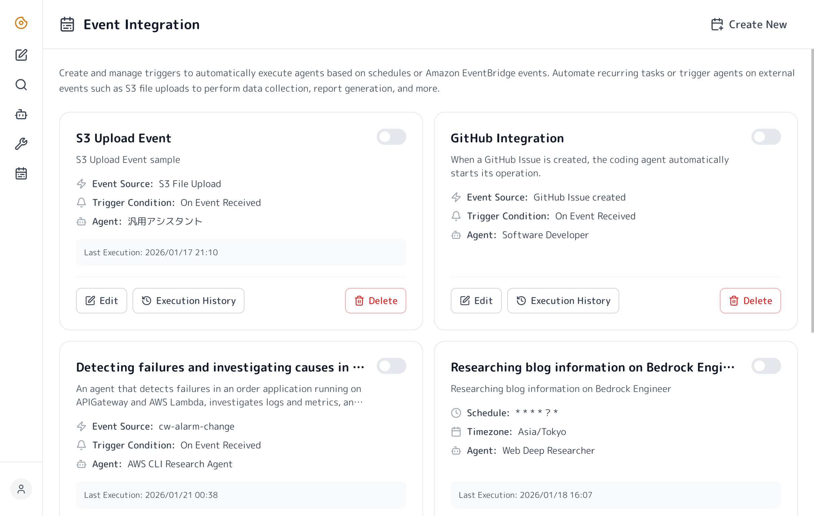
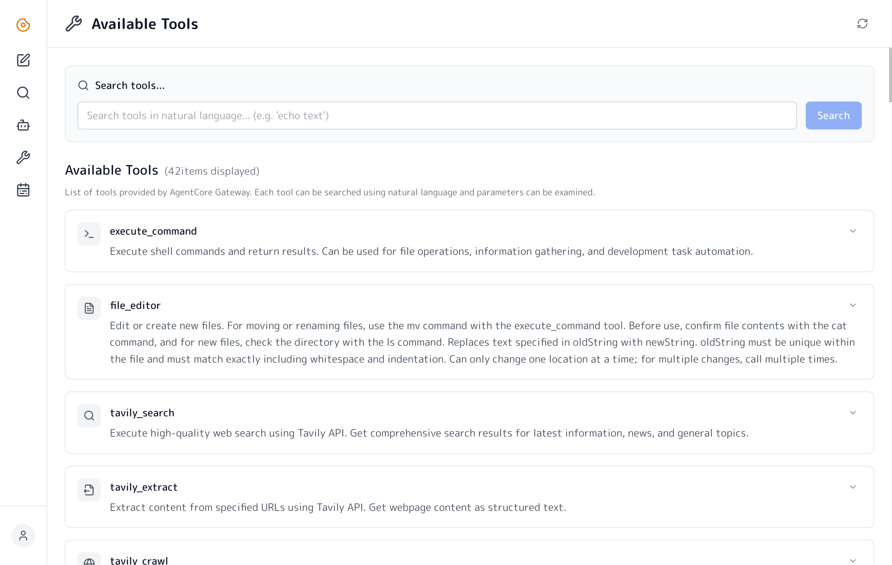
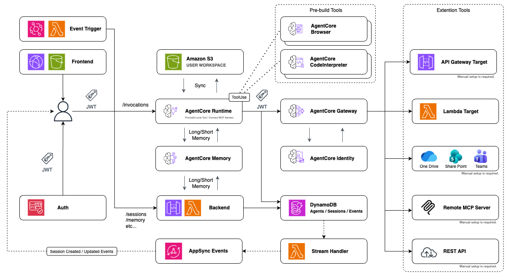

Language: [English](./README.md) / [Japanese](./README-ja.md)

# ☕ Moca — Multi-agent Orchestration Chat on AgentCore

Amazon Bedrock AgentCore を活用したマルチエージェント協調チャットプラットフォームです。

## 概要

Mocaは、チームが AI エージェントを**自由に作成・カスタマイズ**し、組織全体で共有できるマルチエージェントプラットフォームです。Amazon Bedrock AgentCore をベースに構築されており、用途に応じたエージェントを簡単に構築できます。

すぐに使い始められるプリセットエージェントも用意されており、ソフトウェア開発、データ分析、コンテンツ作成など、様々な分野に対応しています。

<div align="center">
  <table>
    <tr>
      <td width="50%">
        
        <p align="center"><b>チャット</b><br/>専門的な AI エージェントとシンプルな UI で対話できます</p>
      </td>
      <td width="50%">
        
        <p align="center"><b>エージェントの共有</b><br/>カスタムエージェントをチーム内で発見・共有できます</p>
      </td>
    </tr>
    <tr>
      <td width="50%">
        
        <p align="center"><b>イベント駆動</b><br/>スケジュールや外部イベントでエージェントを自動実行できます</p>
      </td>
      <td width="50%">
        
        <p align="center"><b>拡張可能なツール</b><br/>ツールを追加・設定してエージェントの機能を拡張できます</p>
      </td>
    </tr>
  </table>
</div>

### 主な特徴

- **カスタムエージェント作成** - 目的に応じたエージェントを自由に設計・構築できます
- **組織内での共有** - 作成したエージェントをチーム全体で発見・共有できます
- **プリセットエージェント** - Software Developer、Data Analyst、Physicist等、すぐに使えるエージェントを用意しています
- **拡張可能なツール** - コマンド実行、Web検索、画像生成、外部サービス連携などに対応しています
- **ファイルストレージ** - ドキュメントやリソース用のクラウドストレージを組み込んでいます
- **エンタープライズ対応** - JWT認証、セッション管理、AWS Cognito統合をサポートしています
- **メモリとコンテキスト** - 永続的な会話履歴とコンテキストを認識します

## アーキテクチャ

本アプリケーションは Amazon Bedrock AgentCore を基盤としたフルサーバーレスアーキテクチャを採用しています。ユーザーリクエストは React フロントエンドから Cognito 認証を経て AgentCore Runtime に到達し、AgentCore Gateway 経由のツール統合とともに AI エージェントが稼働します。

<br>

<div align="center">
  
</div>

<br>

### Tech Stack


| レイヤー | サービス |
|---------|---------|
| フロントエンド | CloudFront + S3 (React SPA) |
| 認証 | Amazon Cognito (JWT) |
| API | Lambda + API Gateway (Express.js) |
| エージェント | AgentCore Runtime + Gateway + Memory + CodeInterpreter|
| ストレージ | DynamoDB + S3 |
| リアルタイム | AppSync Events (WebSocket) |
| イベント | EventBridge Scheduler |

バックエンド API はエージェント管理、セッション永続化、ファイル操作などを担当します。AgentCore Runtime は Strands Agents SDK (TypeScript) を使用してエージェントを実行し、会話コンテキストのための短期記憶（セッション履歴）および長期記憶（永続メモリ）が有効化されています。リアルタイムストリーミングは AppSync Events によって実現され、スケジュールトリガーによって自動的にエージェントを実行することが可能です。

## デプロイ

<details>
<summary><strong>前提条件</strong></summary>

デプロイには以下の環境が必要です。

- **Node.js 22.12.0+** - [n](https://github.com/tj/n)によるバージョン管理を推奨します。`.node-version`を参照してください。
- **AWS CLI** - 適切な認証情報で設定しておく必要があります。

</details>

### AWSへのデプロイ

#### 1. 依存関係のインストール

まず、依存関係をインストールします。

```bash
npm ci
```

#### 2. シークレットの設定（オプション）

必要に応じて、対象環境のAWS Secrets ManagerにAPIキーとトークンを保存します。

**Tavily APIキー**（Web検索ツール用）

```bash
aws secretsmanager create-secret \
  --name "agentcore/default/tavily-api-key" \
  --secret-string "tvly-your-api-key-here" \
  --region ap-northeast-1
```

APIキーは[Tavily](https://tavily.com/)から取得できます。

**GitHubトークン**（GitHub CLI統合用）

```bash
aws secretsmanager create-secret \
  --name "agentcore/default/github-token" \
  --secret-string "ghp_your-token-here" \
  --region ap-northeast-1
```

トークンは[GitHub Settings](https://github.com/settings/tokens)から生成できます。

ローカル開発の場合は、`packages/agent/.env`で環境変数として設定することもできます。

#### 3. CDKのブートストラップ（初回のみ）

初回デプロイ時のみ、CDKのブートストラップを実行します。

```bash
npx -w packages/cdk cdk bootstrap
```

#### 4. スタックのデプロイ

以下のコマンドでスタックをデプロイします。

```bash
npm run deploy
```

デプロイが完了すると、CloudFormationスタックの出力からフロントエンドURLを確認できます。

カスタムドメイン、環境別設定、イベントルールなどの詳細な設定オプションについては、[Deployment Options](docs/deployment-options.md) を参照してください。


## ドキュメント

### 技術ドキュメント
- [Deployment Options](docs/deployment-options.md) - 環境設定とカスタマイズオプション
- [ローカル開発環境のセットアップ](docs/local-development-setup.md) - 環境セットアップの自動化について説明しています

## ライセンス

このプロジェクトはMITライセンスの下でライセンスされています。詳細はLICENSEファイルを参照してください。

## コントリビューション

コントリビューションを歓迎します。プルリクエストをお気軽に送信してください。

## 関連リソース

- [Amazon Bedrockドキュメント](https://docs.aws.amazon.com/bedrock/)
- [AWS CDKドキュメント](https://docs.aws.amazon.com/cdk/)
- [Strands Agents SDK](https://strandsagents.com/)
- [AgentCore Gateway & M365統合ガイド](https://github.com/akadesilva/agentcore-gateway-demos/blob/main/guides/sharepoint-quickstart.md)

# セキュリティ
注意: このアセットは、含まれるサービスの概念実証（Proof of Value）を目的としたものであり、本番環境向けのソリューションとして意図されたものではありません。お客様は、AWS 責任共有モデルがご自身のユースケースにどのように適用されるかを判断し、望ましいセキュリティ成果を達成するために必要なコントロールを実装する必要があります。AWS はお客様を支援するために、幅広いセキュリティツールと構成オプションを提供しています。このリポジトリは実験的なサンプルアプリケーションであり、後方互換性を考慮せずに更新される場合があります。

フルスタックアプリケーションの開発者として、アプリケーションのあらゆる側面のセキュリティを確保することは、最終的にはお客様の責任です。リポジトリのドキュメントではセキュリティのベストプラクティスを提供し、安全なベースラインを提供していますが、このツールから構築されたアプリケーションのセキュリティについて Amazon は一切の責任を負いません。