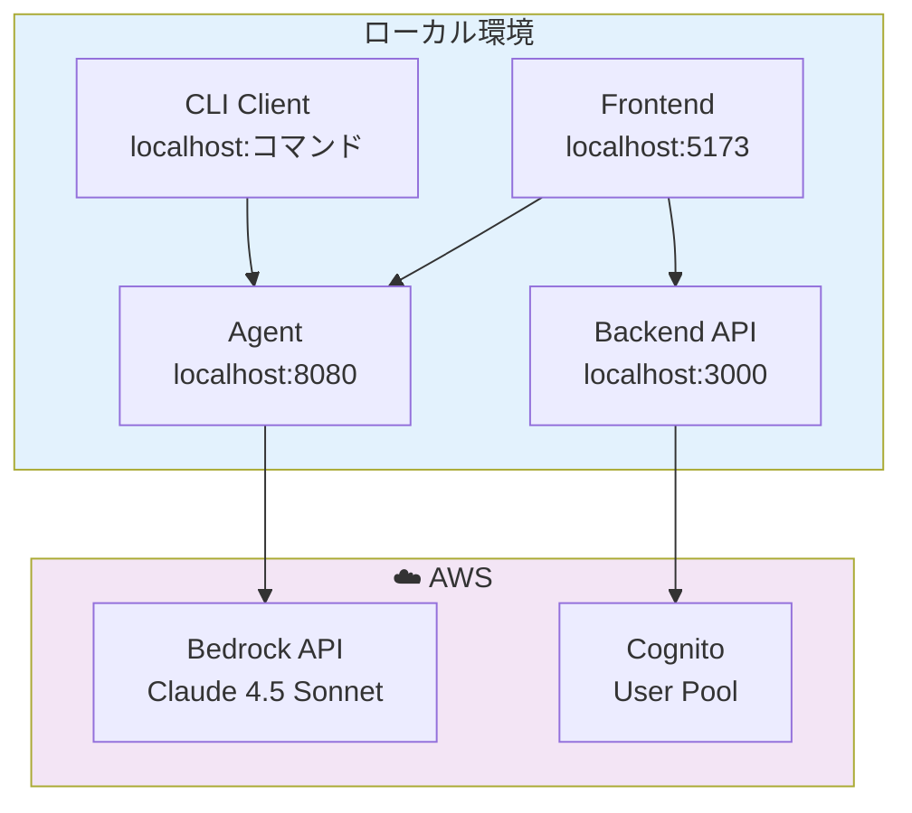

# Fullstack AgentCore

Amazon Bedrock AgentCore を使用したフルスタック AI エージェントシステム。

## 🏗️ アーキテクチャ概要

### システム構成


| コンポーネント | 技術スタック | ポート | 役割 | 対応AWSサービス |
|---------------|-------------|--------|------|----------------|
| **Frontend** | React + Vite + Tailwind CSS | 5173 | Web UI、ユーザーインターフェース | CloudFront, S3 |
| **Backend** | Express + JWT + AWS SDK | 3000 | API サーバー、認証管理 | Lambda, API Gateway |
| **Agent** | Express + Strands Agents SDK | 8080 | AI Agent ランタイム | AgentCore Runtime, AgentCore Memory, Amazon Bedrock |
| **CLI** | Commander.js ベースのクライアント | - | コマンドライン操作 | Cognito (JWT認証) |
| **CDK** | AWS CDK + TypeScript | - | インフラストラクチャ管理 | CloudFormation |
| **Lambda Tools** | AWS Lambda + MCP | - | AgentCore Gateway ツール | Lambda, Bedrock Knowledge Base |

### ローカル開発構成




## 📁 プロジェクト構造

```
fullstack-agentcore/
├── packages/
│   ├── agent/                  # Agent Runtime (Express + Strands)
│   │   ├── src/                # Agent 実装
│   │   ├── scripts/            # 開発スクリプト
│   │   ├── sessions/           # セッション管理
│   │   ├── docs/               # Agent ドキュメント
│   │   ├── docker-compose.yml  # Docker 設定
│   │   ├── Dockerfile          # Docker イメージ
│   │   └── .env.example        # 環境変数テンプレート
│   │
│   ├── backend/                # Backend API (Express + JWT)
│   │   ├── src/                # API 実装
│   │   ├── Dockerfile          # Docker イメージ
│   │   └── docker-compose.yml  # Docker 設定
│   │
│   ├── frontend/               # React Frontend (Vite)
│   │   ├── src/                # Frontend コード
│   │   ├── public/             # 静的ファイル
│   │   └── .env.example        # 環境変数テンプレート
│   │
│   ├── client/                 # CLI クライアント
│   │   ├── src/                # CLI 実装
│   │   └── .env.example        # 環境変数テンプレート
│   │
│   ├── cdk/                    # AWS インフラストラクチャ (CDK)
│   │   ├── lib/                # スタックと Construct 定義
│   │   └── bin/                # CDK アプリケーション
│   │
│   └── lambda-tools/           # AgentCore Gateway ツール
│       └── utility-tools/      # Lambda ユーティリティツール
│
├── docs/                       # プロジェクトドキュメント
│   ├── README.md               # ドキュメント一覧
│   ├── aws-architecture.md     # AWS アーキテクチャ
│   └── jwt-authentication.md   # JWT 認証システム
│
├── .husky/                     # Git hooks
│   └── pre-commit              # コミット前チェック
│
├── cdk.out/                    # CDK 出力ファイル
├── node_modules/               # 依存関係
│
├── package.json                # Workspace 設定
├── tsconfig.base.json          # TypeScript 基本設定
├── eslint.config.mjs           # ESLint 設定
├── .prettierrc                 # Prettier 設定
├── .gitlab-ci.yml              # CI/CD パイプライン
├── openapi.yaml                # API ドキュメント
├── cdk.json                    # CDK 設定
└── README.md                   # このファイル
```

## 🚀 Getting Started (ローカル開発)

### 前提条件

- **Node.js 18+**
- **Docker** (推奨)
- **AWS CLI** 設定済み (Bedrock API 利用のため)
- **デプロイ済みの CDK スタック** (環境変数自動セットアップを使用する場合)

### Step 1: 依存関係のインストール

```bash
# ルートディレクトリで実行
npm install
```

### Step 2: 環境変数の自動セットアップ (推奨)

デプロイ済みの CloudFormation スタックから環境変数を自動取得し、`.env` ファイルを生成します。

```bash
# CloudFormation スタック出力から環境変数を自動生成
npm run setup-env

# スタック名をカスタマイズする場合
STACK_NAME=YourCustomStackName npm run setup-env
```

このコマンドで以下のファイルが自動生成されます：
- `packages/frontend/.env` - Frontend 用環境変数
- `packages/backend/.env` - Backend 用環境変数
- `packages/agent/.env` - Agent 用環境変数

**生成される環境変数:**
- Cognito 認証情報 (User Pool ID, Client ID)
- AWS リージョン
- AgentCore Memory ID
- AgentCore Gateway エンドポイント
- User Storage バケット名

#### 手動セットアップ（オプション）

自動セットアップを使用しない場合は、以下のように手動で設定できます：

```bash
cp packages/agent/.env.example packages/agent/.env
cp packages/backend/.env.example packages/backend/.env
cp packages/frontend/.env.example packages/frontend/.env
```

各 `.env` ファイルを編集して、必要な値を設定してください。

### Step 3: 開発サーバーの起動

#### 方法A: 全サービスを一度に起動 (推奨)

```bash
# Frontend, Backend, Agent を同時に起動
npm run dev
```

このコマンドは以下を実行します：
1. 環境変数の自動セットアップ (`npm run setup-env`)
2. Frontend (localhost:5173)、Backend (localhost:3000)、Agent (localhost:8080) の同時起動

#### 方法B: 個別に起動

```bash
# Frontend のみ起動
npm run dev:frontend

# Backend のみ起動
npm run dev:backend

# Agent のみ起動
npm run dev:agent
```

各コマンドは起動前に自動的に `setup-env` を実行します。

#### 方法C: Docker で起動

```bash
# Agent を Docker で起動
npm run agent:docker

# Backend を Docker で起動
npm run backend:docker
```

### Step 4: 動作確認

#### Frontend から確認

ブラウザで http://localhost:5173 にアクセスして、Web UI から Agent と対話できます。

#### CLI から確認

```bash
# CLI 環境設定
cp packages/client/.env.example packages/client/.env

# CLI で Agent に質問
npm run client:dev -- invoke "今日の天気を教えて"
```

### ~~Step 2: Agent の環境設定・起動~~

**注: この手順は `npm run setup-env` により自動化されました。手動設定が必要な場合のみ以下を参照してください。**

#### 環境変数の設定

```bash
# Agent 環境変数設定
cp packages/agent/.env.example packages/agent/.env
```

`packages/agent/.env` を編集：

```bash
# AWS 認証情報
AWS_ACCESS_KEY_ID=your_access_key_id
AWS_SECRET_ACCESS_KEY=your_secret_access_key
AWS_REGION=us-west-2

# Bedrock 設定
BEDROCK_MODEL_ID=global.anthropic.claude-sonnet-4-5-20250929-v1:0
BEDROCK_REGION=us-west-2

# 開発設定
LOG_LEVEL=info
DEBUG_MCP=false
```

#### Agent の起動（2つの方法）

**方法A: Docker で起動 (推奨)**

```bash
npm run agent:docker
```

**方法B: 直接起動**

```bash
npm run agent:dev
```

### Step 3: 動作確認

#### 方法A: CLI で確認

```bash
# CLI 環境設定
cp packages/client/.env.example packages/client/.env

# CLI で Agent に質問
npm run client:dev -- invoke "今日の天気を教えて"
```

#### 方法B: Frontend で確認

```bash
# Frontend 環境設定
cp packages/frontend/.env.example packages/frontend/.env
```

`packages/frontend/.env` を編集：

```bash
# Agent API 設定
VITE_AGENT_ENDPOINT=http://localhost:8080/invocations

# Cognito 設定（必要に応じて）
VITE_COGNITO_USER_POOL_ID=us-east-1_xxxxxxxxx
VITE_COGNITO_CLIENT_ID=xxxxxxxxxxxxxxxxxxxxxxxxxx
VITE_AWS_REGION=us-east-1
```

Frontend 起動：

```bash
npm run frontend:dev
```

ブラウザで http://localhost:5173 にアクセス

## ☁️ AWS デプロイ

### CDK デプロイ

```bash
# CDK の初回デプロイ
npm run deploy
```

### デプロイ後の設定

デプロイ完了後、出力された情報を使って環境変数を更新：

```bash
# CLI で AWS に接続
# packages/client/.env
AGENTCORE_RUNTIME_ARN=arn:aws:bedrock-agentcore:us-east-1:ACCOUNT_ID:runtime/YOUR_RUNTIME_ID

# Frontend で AWS に接続
# packages/frontend/.env  
VITE_AGENT_ENDPOINT=https://your-gateway-id.bedrock-agentcore.us-east-1.amazonaws.com/invocations
```

## 🛠️ 開発コマンド

### 環境セットアップ

```bash
npm run setup-env              # CloudFormation から環境変数を自動取得
STACK_NAME=CustomStack npm run setup-env  # カスタムスタック名を指定
```

### 統合開発コマンド

```bash
npm run dev                    # 全サービス起動 (Frontend + Backend + Agent)
npm run dev:frontend           # Frontend のみ起動 (setup-env 含む)
npm run dev:backend            # Backend のみ起動 (setup-env 含む)
npm run dev:agent              # Agent のみ起動 (setup-env 含む)
```

### Agent 関連

```bash
npm run agent:dev              # Agent 開発サーバー起動
npm run agent:docker           # Docker で起動
npm run agent:docker:detach    # Docker バックグラウンド起動
npm run agent:docker:stop      # Docker 停止
```

### Backend 関連

```bash
npm run backend:dev            # Backend 開発サーバー起動
npm run backend:build          # ビルド
npm run backend:start          # ビルド後に起動
npm run backend:docker         # Docker で起動
npm run backend:docker:detach  # Docker バックグラウンド起動
npm run backend:docker:stop    # Docker 停止
```

### Frontend 関連

```bash
npm run frontend:dev           # 開発サーバー起動
npm run frontend:build         # ビルド
npm run frontend:preview       # プレビュー
```

### CLI 関連

```bash
npm run client:dev             # CLI 開発モード
npm run client:dev -- invoke "質問"  # 直接実行
```

### CDK 関連

```bash
npm run deploy                 # デプロイ
npm run synth                  # テンプレート生成
npm run diff                   # 差分確認
```

## 🔧 技術仕様

### 使用技術

| 分野 | 技術 |
|------|------|
| **Runtime** | AWS Bedrock AgentCore Runtime |
| **AI Model** | Claude 4.5 Sonnet (グローバル推論プロファイル) |
| **Agent Framework** | Strands Agents SDK |
| **Frontend** | React 19 + Vite + Tailwind CSS |
| **Authentication** | Amazon Cognito User Pool (JWT) |
| **API Gateway** | AgentCore Gateway |
| **Infrastructure** | AWS CDK (TypeScript) |
| **CLI** | Commander.js + Chalk |

### 環境設定

```typescript
// Agent 設定
BEDROCK_MODEL_ID: "global.anthropic.claude-sonnet-4-5-20250929-v1:0"
PORT: 8080

// Frontend 設定
VITE_AGENT_ENDPOINT: "http://localhost:8080/invocations"

// CLI 設定
AGENTCORE_ENDPOINT: "http://localhost:8080"
```
