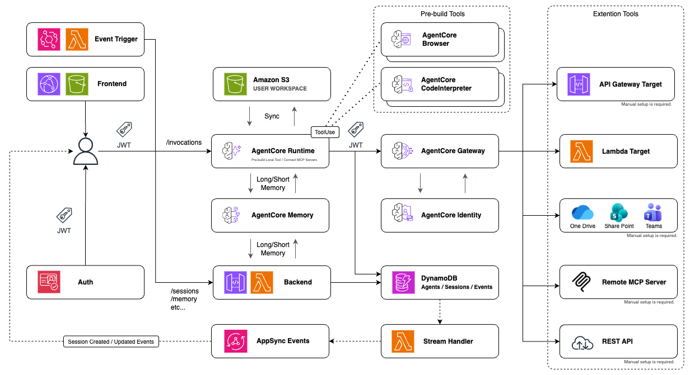

Language: [English](./README.md) / [Japanese](./README-ja.md)

# ☕ Moca — Multi-agent Orchestration Chat on AgentCore

A multi-agent orchestration chat platform built on Amazon Bedrock AgentCore.

## Overview

Moca is a multi-agent platform that enables teams to **create and customize** AI agents and share them across your organization. Built on Amazon Bedrock AgentCore, you can easily build agents tailored to your needs.

Preset agents are also available for immediate use, covering various domains including software development, data analysis, and content creation.

<div align="center">
  <table>
    <tr>
      <td width="50%">
        
        <p align="center"><b>Agent Chat</b><br/>You can interact with specialized AI agents through a simple UI</p>
      </td>
      <td width="50%">
        
        <p align="center"><b>Share Agent</b><br/>You can discover and share custom agents across your team</p>
      </td>
    </tr>
    <tr>
      <td width="50%">
        
        <p align="center"><b>Event-Driven Automation</b><br/>Trigger agents automatically via schedules and external events</p>
      </td>
      <td width="50%">
        
        <p align="center"><b>Extensible Tools</b><br/>Add and configure tools to extend agent capabilities</p>
      </td>
    </tr>
  </table>
</div>

### Key Highlights

- **Custom Agent Creation** - You can design and build agents freely according to your needs
- **Organization-Wide Sharing** - You can discover and share agents across your team
- **Preset Agents** - Ready-to-use agents including Software Developer, Data Analyst, Physicist, and more
- **Extensible Tools** - Supports command execution, web search, image generation, and external service integration
- **File Storage** - Includes built-in cloud storage for documents and resources
- **Enterprise Ready** - Supports JWT authentication, session management, and AWS Cognito integration
- **Memory and Context** - Recognizes persistent conversation history and context

## Architecture

This application uses a fully serverless architecture built on Amazon Bedrock AgentCore. User requests flow from the React frontend through Cognito authentication to the AgentCore Runtime, which orchestrates AI agent execution with tool integration via the AgentCore Gateway.

<br>

<div align="center">
  
</div>

<br>

### Tech Stack

| Layer | Services |
|-------|----------|
| Frontend | CloudFront + S3 (React SPA) |
| Auth | Amazon Cognito (JWT) |
| API | Lambda + API Gateway (Express.js) |
| Agent | AgentCore Runtime + Gateway + Memory + CodeInterpreter|
| Storage | DynamoDB + S3 |
| Real-time | AppSync Events (WebSocket) |
| Events | EventBridge Scheduler |

The backend API is responsible for agent management, session persistence, and file operations. AgentCore Runtime executes agents using the Strands Agents SDK (TypeScript), with short-term memory (session history) for conversational context and long-term memory (persistent memory) enabled. Real-time streaming is achieved via AppSync Events, allowing agents to be automatically executed by schedule triggers.

## Deployment

<details>
<summary><strong>Prerequisites</strong></summary>

The following environment is required for deployment.

- **Node.js 22.12.0+** - Version management with [n](https://github.com/tj/n) is recommended. See `.node-version`.
- **AWS CLI** - Must be configured with appropriate credentials.

</details>

### Deploy to AWS

#### 1. Install dependencies

First, install the dependencies.

```bash
npm ci
```

#### 2. Configure Secrets (Optional)

If needed, store API keys and tokens in AWS Secrets Manager for your target environment.

**Tavily API Key** (for web search tools)

```bash
aws secretsmanager create-secret \
  --name "agentcore/default/tavily-api-key" \
  --secret-string "tvly-your-api-key-here" \
  --region ap-northeast-1
```

You can get your API key from [Tavily](https://tavily.com/).

**GitHub Token** (for GitHub CLI integration)

```bash
aws secretsmanager create-secret \
  --name "agentcore/default/github-token" \
  --secret-string "ghp_your-token-here" \
  --region ap-northeast-1
```

You can generate a token from [GitHub Settings](https://github.com/settings/tokens).

For local development, you can also set these as environment variables in `packages/agent/.env`.

#### 3. Bootstrap CDK (first time only)

For the first deployment, run CDK bootstrap.

```bash
npx -w packages/cdk cdk bootstrap
```

#### 4. Deploy the stack

Deploy the stack with the following commands.

```bash
npm run deploy
```

After deployment, you can find the Frontend URL in the CloudFormation stack outputs.

For advanced configuration options such as custom domains, environment-specific settings, and event rules, see the [Deployment Options](docs/deployment-options.md) documentation.


## Documentation

### User Guides
- [User Guide (English)](docs/USER_GUIDE.md) - Feature introduction and end-user guide
- [User Guide (Japanese)](docs/USER_GUIDE-ja.md) - Feature introduction and end-user guide

### Technical Documentation
- [Deployment Options](docs/deployment-options.md) - Environment configuration and customization
- [Local Development Setup](docs/local-development-setup.md) - Explains environment setup automation
- [JWT Authentication System](docs/jwt-authentication.md) - Explains the authentication mechanism
- [Architecture Diagram](docs/moca-architecture.drawio.png)

## License

This project is licensed under the MIT License. See the LICENSE file for details.

## Contributing

Contributions are welcome. Please feel free to submit a Pull Request.

## Related Resources

- [Amazon Bedrock Documentation](https://docs.aws.amazon.com/bedrock/)
- [AWS CDK Documentation](https://docs.aws.amazon.com/cdk/)
- [Strands Agents SDK](https://strandsagents.com/)
- [AgentCore Gateway & M365 Integration Guide](https://github.com/akadesilva/agentcore-gateway-demos/blob/main/guides/sharepoint-quickstart.md)

---

This repository is an experimental sample application and may be updated without considering backward compatibility. For official AgentCore sample code published by AWS, please refer to [fullstack-solution-template-for-agentcore](https://github.com/awslabs/fullstack-solution-template-for-agentcore) or [sample-amazon-bedrock-agentcore-fullstack-webapp](https://github.com/aws-samples/sample-amazon-bedrock-agentcore-fullstack-webapp).