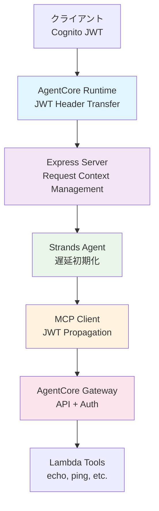

# Fullstack AgentCore

AWS Bedrock AgentCore を使用したフルスタック AI エージェントシステム。JWT 認証による安全なマルチエージェント通信を実現します。

## 🏗️ アーキテクチャ概要

### システム構成図



### JWT 認証フロー

```
┌─────────────┐    JWT    ┌──────────────────┐    JWT    ┌─────────────┐
│   Client    │ ────────▶ │ AgentCore Runtime │ ────────▶ │   Express   │
│  (Cognito)  │           │ (Header Forward) │           │   Server    │
└─────────────┘           └──────────────────┘           └─────────────┘
                                                                 │
                                                                 │ JWT Context
                                                                 ▼
┌─────────────┐           ┌──────────────────┐           ┌─────────────┐
│   Gateway   │ ◀──────── │   MCP Client     │ ◀──────── │ Agent Tools │
│ (API + Auth)│    JWT    │ (JWT Propagation)│   Context │ (Strands)   │
└─────────────┘           └──────────────────┘           └─────────────┘
```

## 🔑 JWT 認証ヘッダー転送機能

### 実装された機能

#### 1. AgentCore Runtime レベル

- **CDK L2 Construct**: `requestHeaderConfiguration.allowlistedHeaders: ["Authorization"]`
- JWT Bearer Token の完全な転送機能
- AWS 公式仕様に完全準拠

#### 2. Express Server レベル

- Authorization ヘッダーの受信と処理
- AsyncLocalStorage によるリクエストスコープ管理
- JWT コンテキストでの Agent 初期化（遅延初期化パターン）

#### 3. MCP Client レベル

- JWT 伝播ロジックの実装
- ツール呼び出し時の認証ヘッダー転送
- 認証レベル分離（ツール一覧取得：認証不要、実行：必須）

#### 4. エンドツーエンド動作

- Client → AgentCore Runtime → Express → MCP Client → Gateway
- 完全な JWT 認証チェーンの確立

## 📁 プロジェクト構造

```
fullstack-agentcore/
├── packages/
│   ├── cdk/                    # AWS インフラストラクチャ (CDK)
│   │   ├── lib/                # スタックと Construct 定義
│   │   └── scripts/            # JWT 認証テストスクリプト
│   │
│   ├── agent/                  # Agent Runtime (Express + Strands)
│   │   ├── src/                # JWT 伝播機能付き Agent 実装
│   │   └── scripts/            # ローカル開発・テスト用スクリプト
│   │
│   ├── client/                 # CLI クライアント
│   │   └── src/                # Cognito 認証付き API クライアント
│   │
│   └── lambda-tools/           # AgentCore Gateway ツール
│       └── tools/echo-tool/    # サンプル Lambda ツール実装
│
├── cdk.json                    # CDK 設定
└── README.md                   # このファイル
```

## 🚀 セットアップ・実行方法

### 前提条件

- Node.js 18+
- AWS CLI 設定済み
- Docker
- AWS CDK v2

### 1. 依存関係のインストール

```bash
# ルートディレクトリで実行
npm install

# 各パッケージのインストール
cd packages/cdk && npm install
cd ../agent && npm install
cd ../lambda-tools/tools/echo-tool && npm install
```

### 2. デプロイ

```bash
# CDK デプロイ
cdk deploy --require-approval never
```

### 3. JWT 認証機能のテスト

#### 基本認証テスト

```bash
cd packages/cdk/scripts
./test-jwt-auth.sh
```

#### JWT 伝播テスト（エンドツーエンド）

```bash
cd packages/cdk/scripts
./test-jwt-propagation.sh
```

### 4. ログ確認

CloudWatch でリアルタイムログを確認：

```bash
# Runtime ログ確認
aws logs describe-log-groups --log-group-name-prefix "/aws/bedrock-agentcore/runtimes"

# 最新ログストリーム確認
aws logs describe-log-streams \
  --log-group-name "/aws/bedrock-agentcore/runtimes/StrandsAgentsTS-XXXXX-DEFAULT" \
  --order-by LastEventTime --descending --max-items 1

# ログ内容確認
aws logs get-log-events \
  --log-group-name "/aws/bedrock-agentcore/runtimes/StrandsAgentsTS-XXXXX-DEFAULT" \
  --log-stream-name "STREAM_NAME"
```

## 🔧 技術仕様

### 使用技術

- **Runtime**: AWS Bedrock AgentCore Runtime
- **AI Model**: Claude 4.5 Sonnet (グローバル推論プロファイル)
- **Agent Framework**: Strands Agents SDK
- **Authentication**: Amazon Cognito User Pool (JWT)
- **API Gateway**: AgentCore Gateway with Lambda integration
- **Infrastructure**: AWS CDK (TypeScript)

### 認証設定

#### Cognito User Pool

- **User Pool ID**: `us-east-1_OZ6KUvSn3`
- **Client ID**: `19duob1sqr877jesho69aildbn`
- **Token Type**: Access Token (Bearer)
- **Validation**: JWT signature + expiration

#### JWT Claims

```json
{
  "sub": "user-uuid",
  "client_id": "19duob1sqr877jesho69aildbn",
  "iss": "https://cognito-idp.us-east-1.amazonaws.com/us-east-1_OZ6KUvSn3",
  "exp": 1734507600,
  "token_use": "access"
}
```

### Runtime 設定

```typescript
// CDK Configuration
requestHeaderConfiguration: {
  allowlistedHeaders: ["Authorization"];
}

// Environment Variables
BEDROCK_MODEL_ID: "global.anthropic.claude-sonnet-4-5-20250929-v1:0";
AGENTCORE_GATEWAY_ENDPOINT: "https://api.gateway.endpoint";
```

## 🧪 テスト

### JWT 伝播テストの期待される動作

1. **JWT 認証通過**: HTTP 200 ステータス
2. **ツール実行成功**: echo-tool, ping-tool の正常応答
3. **ログ確認**:
   ```
   authorization: 'PRESENT'
   hasAuth: true
   authType: 'Bearer'
   リクエストコンテキストから JWT を使用
   ```

### テスト成功例

```bash
HTTP Status: 200
✅ リクエスト成功!
📋 レスポンス: {"response":{"type":"agentResult","stopReason":"endTurn"...
🆔 Request ID: 2095fd8a-9ceb-4689-9b3b-f7f59998a382
```

## 🛠️ 開発

### ローカル開発

```bash
# Agent の開発サーバー起動
cd packages/agent
npm run dev

# Docker での起動
cd packages/agent
docker-compose up --build
```

### デバッグログの有効化

```typescript
// packages/agent/src/config/index.ts
export const config = {
  DEBUG_MCP: true, // MCP通信ログ
  LOG_LEVEL: "debug",
};
```

## 📊 監視・運用

### CloudWatch メトリクス

- AgentCore Runtime 呼び出し数
- JWT 認証成功/失敗数
- ツール実行時間
- エラー率

### アラート設定

- JWT 認証失敗率 > 5%
- Runtime エラー率 > 1%
- レスポンス時間 > 30 秒

## 🔒 セキュリティ

### 実装されたセキュリティ機能

1. **JWT 署名検証**: Cognito による自動検証
2. **トークン有効期限**: 1 時間の短期間トークン
3. **スコープ分離**: ツール一覧は認証不要、実行は認証必須
4. **リクエストスコープ**: AsyncLocalStorage による安全な認証情報管理

### セキュリティベストプラクティス

- JWT トークンのログ出力禁止
- HTTPS 通信の強制
- 最小権限の原則に基づく IAM ロール設定
- 定期的なトークンローテーション

## 📖 参考資料

- [AWS Bedrock AgentCore Documentation](https://docs.aws.amazon.com/bedrock/latest/userguide/agents-runtime.html)
- [Strands Agents SDK](https://docs.strands-ai.com/)
- [Amazon Cognito JWT Tokens](https://docs.aws.amazon.com/cognito/latest/developerguide/amazon-cognito-user-pools-using-tokens-with-identity-providers.html)

## 🤝 コントリビューション

1. Fork the repository
2. Create your feature branch (`git checkout -b feature/amazing-feature`)
3. Commit your changes (`git commit -m 'Add some amazing feature'`)
4. Push to the branch (`git push origin feature/amazing-feature`)
5. Open a Pull Request

## 📄 ライセンス

MIT License - 詳細は [LICENSE](LICENSE) ファイルをご覧ください。

---

## 🎯 実装ハイライト

この実装では、AWS Bedrock AgentCore の公式仕様に完全準拠した JWT 認証ヘッダー転送機能を実現しています。

**主な技術的成果:**

- ✅ CDK L2 Construct での `requestHeaderConfiguration` 活用
- ✅ 遅延初期化パターンによる JWT コンテキスト内 Agent 起動
- ✅ AsyncLocalStorage による Node.js リクエストスコープ管理
- ✅ 認証レベル分離によるセキュリティとパフォーマンスの両立
- ✅ エンドツーエンドでの完全な JWT 認証チェーン確立

これにより、セキュアで拡張可能なマルチエージェント AI システムが完成しました。
