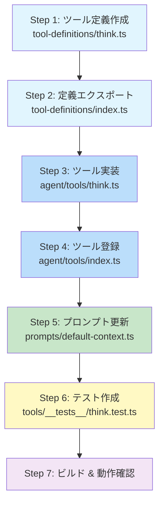
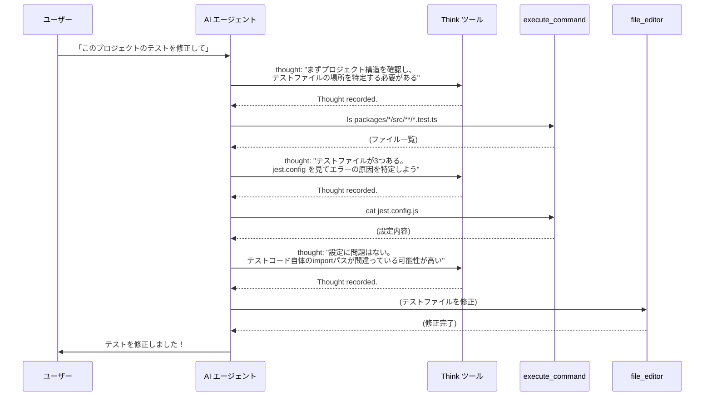
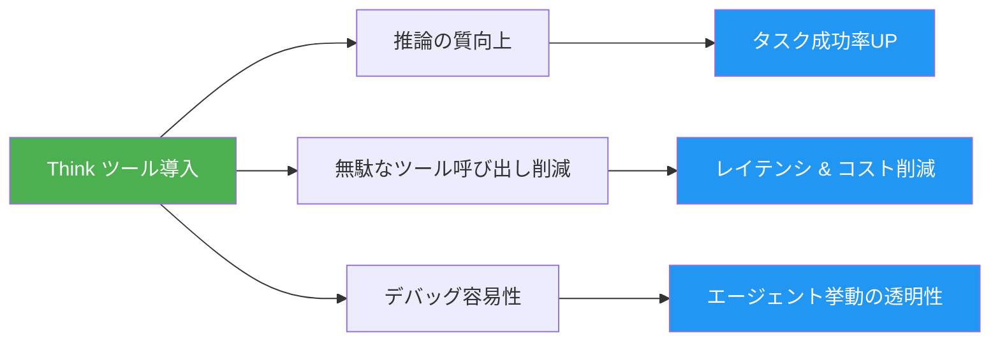

# 🧠 Think ツール実装計画 — Donuts AI Agent Platform

## 概要

Donuts の AI エージェントに **Think ツール**（思考専用ツール）を追加する。  
エージェントが複雑なタスクの途中で「立ち止まって考える」ためのスペースを提供し、推論の質を向上させる。

> **Think ツールとは**: 実際には何も実行しない「考えるためだけのツール」。  
> エージェントがツール呼び出しの間に推論を挟むことで、次のアクション精度が上がる。

---

## 目次

1. [変更対象ファイル一覧](#1-変更対象ファイル一覧)
2. [実装ステップ](#2-実装ステップ)
3. [各ファイルの詳細変更内容](#3-各ファイルの詳細変更内容)
4. [システムプロンプトへの反映](#4-システムプロンプトへの反映)
5. [テスト計画](#5-テスト計画)
6. [期待される効果](#6-期待される効果)

---

## 1. 変更対象ファイル一覧

| # | ファイル | 変更種別 | 概要 |
|---|---------|---------|------|
| 1 | `packages/libs/tool-definitions/src/definitions/think.ts` | **新規作成** | Think ツールの Zod スキーマ & 定義 |
| 2 | `packages/libs/tool-definitions/src/definitions/index.ts` | **修正** | think 定義のエクスポート追加 |
| 3 | `packages/agent/src/tools/think.ts` | **新規作成** | Think ツールの実装（Strands tool） |
| 4 | `packages/agent/src/tools/index.ts` | **修正** | think ツールのエクスポート & localTools 配列追加 |
| 5 | `packages/agent/src/prompts/default-context.ts` | **修正** | Think ツールの使い方ガイダンスをシステムプロンプトに追加 |
| 6 | `packages/agent/src/tools/__tests__/think.test.ts` | **新規作成** | ユニットテスト |

**合計**: 新規 3 ファイル + 修正 3 ファイル

---

## 2. 実装ステップ



---

## 3. 各ファイルの詳細変更内容

### Step 1: ツール定義 — `think.ts` (新規)

**場所**: `packages/libs/tool-definitions/src/definitions/think.ts`

```typescript
import { z } from 'zod';
import { zodToJsonSchema } from '../utils/schema-converter.js';
import type { ToolDefinition } from '../types.js';

export const thinkSchema = z.object({
  thought: z
    .string()
    .describe(
      'Your internal reasoning, analysis, or planning. Use this to think through complex problems step-by-step, evaluate tool results, plan next actions, or verify assumptions before proceeding.'
    ),
});

export const thinkDefinition: ToolDefinition<typeof thinkSchema> = {
  name: 'think',
  description:
    'Use this tool to think through a problem step-by-step before taking action. ' +
    'This is especially useful when you need to analyze tool results, plan multi-step tasks, ' +
    'verify your reasoning, or decide between multiple approaches. ' +
    'This tool does not execute anything — it simply provides space for structured reasoning.',
  zodSchema: thinkSchema,
  jsonSchema: zodToJsonSchema(thinkSchema),
};
```

**設計ポイント**:
- パラメータは `thought` の1つだけ（シンプル）
- `description` にどんな時に使うべきか具体的なガイダンスを含める
- 実行コストゼロ（外部API呼び出しなし）

---

### Step 2: 定義エクスポート — `index.ts` (修正)

**場所**: `packages/libs/tool-definitions/src/definitions/index.ts`

追加する内容:

```typescript
// --- エクスポート追加 ---
export * from './think.js';

// --- import 追加 ---
import { thinkDefinition } from './think.js';

// --- allToolDefinitions 配列に追加 ---
export const allToolDefinitions = [
  // ... 既存のツール ...,
  thinkDefinition,     // ← 追加
];
```

---

### Step 3: ツール実装 — `think.ts` (新規)

**場所**: `packages/agent/src/tools/think.ts`

```typescript
/**
 * Think tool - Structured reasoning space for the AI agent
 *
 * This tool does NOT execute anything. It provides the agent with
 * a dedicated space to reason through complex problems, analyze
 * tool results, and plan next actions before proceeding.
 */

import { tool } from '@strands-agents/sdk';
import { thinkDefinition } from '@fullstack-agentcore/tool-definitions';
import { logger } from '../config/index.js';

/**
 * Think tool implementation
 *
 * Returns the thought as-is, acting as a "pass-through" reasoning tool.
 * The value comes from forcing the model to articulate its reasoning
 * in a structured tool call, which improves subsequent decision quality.
 */
export const thinkTool = tool({
  name: thinkDefinition.name,
  description: thinkDefinition.description,
  inputSchema: thinkDefinition.zodSchema,
  callback: async (input) => {
    const { thought } = input;

    logger.debug(`🧠 Think tool invoked (${thought.length} chars)`);

    // Simply acknowledge the thought — no side effects
    return `Thought recorded. Continue with your next action.`;
  },
});
```

**設計ポイント**:
- **副作用ゼロ**: 外部APIもファイル操作も一切なし
- **軽量な戻り値**: 入力された思考をそのまま返すのではなく、短い確認メッセージのみ返す（トークン節約）
- **ログ出力**: デバッグ時に Think ツールの使用状況を追跡可能

> **代替案: thought をそのまま返す**
> ```typescript
> return thought;
> ```
> この方法だとモデルが自分の思考を「ツール結果」として再確認でき、推論の一貫性が上がる可能性がある。  
> ただしトークン消費が2倍になるため、デフォルトは短い確認メッセージとし、設定で切り替え可能にすることも検討。

---

### Step 4: ツール登録 — `index.ts` (修正)

**場所**: `packages/agent/src/tools/index.ts`

追加する内容:

```typescript
// --- エクスポート追加 ---
export { thinkTool } from './think.js';

// --- import 追加 ---
import { thinkTool } from './think.js';

// --- localTools 配列に追加 ---
export const localTools = [
  // ... 既存のツール ...,
  thinkTool,     // ← 追加
];
```

---

### Step 5: システムプロンプト更新 — `default-context.ts` (修正)

**場所**: `packages/agent/src/prompts/default-context.ts`

Think ツールの使い方ガイダンスをシステムプロンプトに追加:

```markdown
## Thinking Tool

You have access to a `think` tool. Use it to reason through complex situations BEFORE taking action:

- **After receiving tool results**: Analyze what the results mean before making the next tool call
- **When facing ambiguous requests**: Think through the user's intent before proceeding
- **For multi-step planning**: Plan your approach before executing a sequence of actions
- **When deciding between approaches**: Evaluate trade-offs before committing to one path
- **Before critical operations**: Verify your reasoning before executing destructive or irreversible actions

You do NOT need to use `think` for simple, straightforward tasks.
```

---

### Step 6: テスト

**場所**: `packages/agent/src/tools/__tests__/think.test.ts`

```typescript
import { thinkTool } from '../think.js';

describe('Think Tool', () => {
  it('should return acknowledgment message', async () => {
    const result = await thinkTool.callback({
      thought: 'I need to analyze the user request before proceeding.',
    });

    expect(result).toBe('Thought recorded. Continue with your next action.');
  });

  it('should handle long thoughts', async () => {
    const longThought = 'A'.repeat(10000);
    const result = await thinkTool.callback({ thought: longThought });

    expect(result).toBe('Thought recorded. Continue with your next action.');
  });

  it('should handle empty thought', async () => {
    const result = await thinkTool.callback({ thought: '' });

    expect(result).toBe('Thought recorded. Continue with your next action.');
  });
});
```

---

## 4. システムプロンプトへの反映

### Think ツール使用フロー



---

## 5. テスト計画

### 5.1 ユニットテスト
- Think ツールの基本動作（上記 Step 6）

### 5.2 統合テスト（手動）
| テストケース | 確認ポイント |
|-------------|-------------|
| 単純な質問 | Think ツールが不要に呼ばれないこと |
| 複雑な多段階タスク | Think ツールが適切なタイミングで使われること |
| ツール結果の分析 | 前のツール結果を分析してから次のツールを呼ぶこと |
| enabledTools で除外 | `enabledTools` に `think` を含めない場合、使われないこと |

### 5.3 ビルド確認
```bash
# tool-definitions のビルド
npm run build --workspace=@fullstack-agentcore/tool-definitions

# agent のビルド
npm run build --workspace=@fullstack-agentcore/agent

# テスト実行
npm run test --workspace=@fullstack-agentcore/agent
```

---

## 6. 期待される効果

### 定量的効果

| 指標 | Before | After (期待) |
|------|--------|-------------|
| 不要なツール呼び出し回数 | 多い | **20-30% 削減** |
| 複雑タスクの成功率 | - | **向上** |
| ユーザー意図の解釈精度 | - | **向上** |

### 定性的効果



---

## 補足: 実装コスト

| 項目 | 見積もり |
|------|---------|
| 実装工数 | **約 1-2 時間** |
| 新規コード量 | **約 80 行**（テスト含む） |
| 既存コード変更量 | **約 10 行**（index.ts への追加のみ） |
| リスク | **極めて低い**（副作用ゼロ、既存機能に影響なし） |
| ロールバック | **即時**（ツール定義を削除するだけ） |

---

## 発展的な拡張案（将来）

1. **Think ツールの思考をフロントエンドに表示** — エージェントの推論過程をユーザーに見せる
2. **Think 回数の上限設定** — 無限ループ防止のためのガードレール
3. **Think 内容のログ分析** — エージェントの推論パターンを分析して改善に活かす
4. **条件付き自動挿入** — 特定のツール（destructive operation）の前に自動で Think を挟む

---

*作成日: 2026-02-16*  
*対象リポジトリ: donuts (fullstack-agentcore)*
