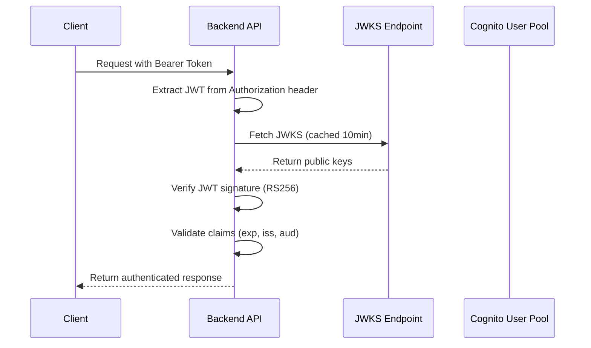

# Backend API Server

JWT認証対応のExpress APIサーバーです。Amazon Cognito User PoolのJWKS検証をサポートし、API Gateway + Lambdaデプロイメントに対応しています。

## 📋 目次

- [機能](#-機能)
- [API エンドポイント](#-api-エンドポイント)
- [セットアップ](#-セットアップ)
- [開発環境](#-開発環境)
- [Docker 使用方法](#-docker-使用方法)
- [環境変数](#-環境変数)
- [JWT認証](#-jwt認証)
- [デプロイメント](#-デプロイメント)

## 🚀 機能

- **JWT認証**: Amazon Cognito User Pool JWKS検証
- **Express API**: RESTful APIサーバー
- **CORS対応**: フロントエンド連携
- **TypeScript**: 型安全な実装
- **Docker対応**: コンテナ化された実行環境
- **ヘルスチェック**: API Gateway / Lambda 対応
- **開発モード**: JWKS検証のスキップ機能

## 🔌 API エンドポイント

### ヘルスチェック（認証不要）

```bash
GET /ping
```

**レスポンス例:**
```json
{
  "status": "healthy",
  "timestamp": "2025-12-19T10:42:00.000Z",
  "uptime": 123.456,
  "service": "agentcore-backend",
  "version": "0.1.0",
  "environment": "development",
  "jwks": {
    "configured": true,
    "uri": "[CONFIGURED]"
  }
}
```

### ユーザー情報取得（認証必要）

```bash
GET /me
Authorization: Bearer <jwt_token>
```

**レスポンス例:**
```json
{
  "authenticated": true,
  "user": {
    "id": "12345678-1234-1234-1234-123456789012",
    "username": "john.doe",
    "email": "john.doe@example.com",
    "groups": ["users", "admins"]
  },
  "jwt": {
    "tokenUse": "access",
    "issuer": "https://cognito-idp.ap-northeast-1.amazonaws.com/ap-northeast-1_xxxxxxxxx",
    "audience": "your-client-id",
    "issuedAt": "2025-12-19T10:00:00.000Z",
    "expiresAt": "2025-12-19T11:00:00.000Z",
    "clientId": "your-client-id",
    "authTime": "2025-12-19T10:00:00.000Z"
  },
  "request": {
    "id": "req_1703057520123_abc123",
    "timestamp": "2025-12-19T10:42:00.000Z",
    "ip": "127.0.0.1",
    "userAgent": "Mozilla/5.0 ..."
  }
}
```

### API情報（認証不要）

```bash
GET /
```

API仕様とドキュメント情報を返します。

## 🛠 セットアップ

### 依存関係のインストール

```bash
# プロジェクトルートから
npm install

# または backend ディレクトリで直接
cd packages/backend
npm install
```

### 環境変数の設定

```bash
# .env.example をコピーして .env を作成
cp .env.example .env

# .env ファイルを編集して必要な環境変数を設定
```

## 👨‍💻 開発環境

### 開発サーバーの起動

```bash
# ルートから（推奨）
npm run backend:dev

# または backend ディレクトリから直接
cd packages/backend
npm run dev
```

### ビルド

```bash
# TypeScript コンパイル
npm run build

# 本番サーバー起動
npm start
```

### 利用可能なスクリプト

```bash
npm run dev          # 開発サーバー（ホットリロード）
npm run build        # TypeScript ビルド
npm run start        # 本番サーバー起動
npm run clean        # ビルド結果削除
```

## 🐳 Docker 使用方法

### Docker イメージのビルド

```bash
# 単体でビルド
docker build -t agentcore-backend .

# Docker Compose でビルド＆起動
docker-compose up --build

# バックグラウンドで起動
docker-compose up -d --build
```

### Docker 管理コマンド

```bash
# ログを確認
docker-compose logs -f

# コンテナを停止
docker-compose down

# ヘルスチェック
docker-compose exec agentcore-backend curl http://localhost:3000/ping
```

### 利用可能な Docker スクリプト

```bash
npm run docker:build       # イメージビルド
npm run docker:run         # シンプル起動
npm run docker:dev         # compose で開発環境起動
npm run docker:dev:detach  # バックグラウンド起動
npm run docker:stop        # compose 停止
npm run docker:logs        # ログ確認
npm run docker:test        # ヘルスチェック
```

## ⚙️ 環境変数

| 変数名 | 必須 | デフォルト | 説明 |
|--------|------|-----------|------|
| `PORT` | ❌ | `3000` | サーバーポート |
| `NODE_ENV` | ❌ | `development` | 実行環境 |
| `CORS_ALLOWED_ORIGINS` | ❌ | `*` | CORS許可オリジン |
| `COGNITO_USER_POOL_ID` | ⚠️ | - | Cognito User Pool ID |
| `COGNITO_REGION` | ⚠️ | - | AWS リージョン |
| `JWKS_URI` | ⚠️ | - | JWKS エンドポイント URL |
| `JWT_ISSUER` | ❌ | - | JWT Issuer（オプション） |
| `JWT_AUDIENCE` | ❌ | - | JWT Audience（オプション） |

⚠️ = 本番環境では必須

### 環境設定のパターン

#### パターン1: 開発環境（JWT検証なし）

```env
PORT=3000
NODE_ENV=development
CORS_ALLOWED_ORIGINS=*
# JWT設定は未設定 → デコードのみ実行
```

#### パターン2: 本番相当（JWT検証あり）

```env
PORT=3000
NODE_ENV=production
CORS_ALLOWED_ORIGINS=https://your-domain.com
COGNITO_USER_POOL_ID=ap-northeast-1_xxxxxxxxx
COGNITO_REGION=ap-northeast-1
```

## 🔐 JWT認証

### サポートするトークン形式

- **Authorization Header**: `Bearer <jwt_token>`
- **トークンタイプ**: Cognito Access Token / ID Token
- **署名アルゴリズム**: RS256

### 検証フロー



### 開発環境での動作

- **JWKS設定あり**: 完全なJWT検証を実行
- **JWKS設定なし**: デコードのみ実行（検証スキップ）
- **本番環境**: 必ずJWKS検証を実行

### JWT ペイロード例

```json
{
  "sub": "12345678-1234-1234-1234-123456789012",
  "cognito:username": "john.doe",
  "email": "john.doe@example.com",
  "token_use": "access",
  "client_id": "your-client-id",
  "cognito:groups": ["users", "admins"],
  "iss": "https://cognito-idp.ap-northeast-1.amazonaws.com/ap-northeast-1_xxxxxxxxx",
  "exp": 1703061600,
  "iat": 1703058000,
  "auth_time": 1703058000
}
```

## 🚀 デプロイメント

### API Gateway + Lambda

このBackend APIは将来的にAWS API Gateway + Lambdaでデプロイする予定で設計されています。

- **ヘルスチェック**: `/ping` エンドポイント
- **CORS**: プリフライト対応
- **エラーハンドリング**: 標準的なHTTPステータスコード
- **JWT検証**: Cognito User Pool統合

### 本番環境チェックリスト

- [ ] `NODE_ENV=production` に設定
- [ ] Cognito User Pool の設定完了
- [ ] JWKS URI の設定完了
- [ ] CORS オリジンの適切な設定
- [ ] ログ監視の設定
- [ ] ヘルスチェックの確認

## 🧪 テスト

### ローカルテスト

```bash
# サーバー起動
npm run dev

# ヘルスチェック
curl http://localhost:3000/ping

# JWT認証テスト（要トークン）
curl -H "Authorization: Bearer <your_jwt_token>" http://localhost:3000/me
```

### Docker環境テスト

```bash
# Docker で起動
docker-compose up -d

# ヘルスチェック
npm run docker:test
```

## 📝 ログ

各エンドポイントへのアクセスは詳細にログ出力されます：

```
🔐 JWT認証開始 (req_1703057520123_abc123): { method: 'GET', path: '/me', ... }
✅ JWT認証成功 (req_1703057520123_abc123): { userId: '...', username: '...' }
👤 /me リクエスト成功 (req_1703057520123_abc123): { userId: '...', ... }
```

## 🤝 Contributing

1. feature ブランチを作成
2. 変更を実装
3. テストの実行
4. プルリクエストを作成

## 📄 License

MIT License
