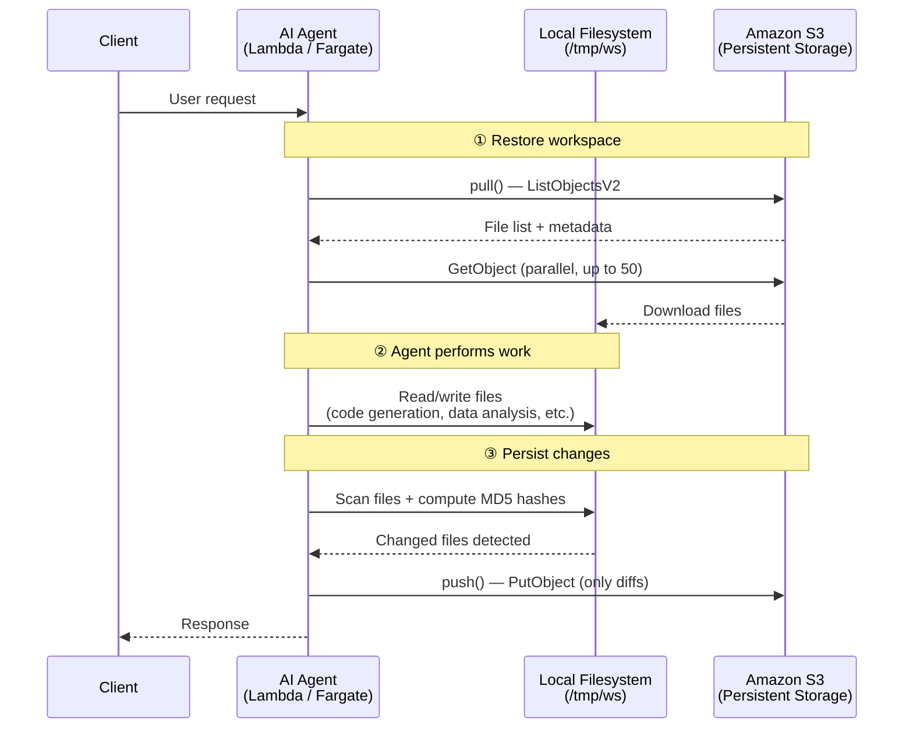
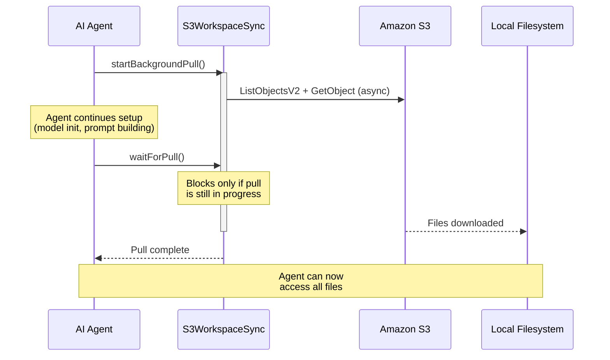

# @moca/s3-workspace-sync

Bidirectional file sync between **Amazon S3** and a **local workspace directory** with MD5-hash-based diff detection, `.syncignore` support, and configurable concurrent transfers.

## Why — The Ephemeral Filesystem Problem

AI Agents that perform file operations — code generation, data analysis, report creation — need a **workspace directory** where they can read and write files. However, modern cloud-native environments are inherently **ephemeral**:

| Environment | Filesystem Behavior |
|---|---|
| **AWS Lambda** | `/tmp` is wiped between cold starts. Max 512 MB (10 GB with ephemeral storage). |
| **AWS Fargate / ECS** | Container filesystem is destroyed when the task stops or scales down. |
| **Serverless Containers** (AgentCore Runtime, App Runnter, etc.) | Same — no persistent local state across invocations. |

This means that every file an agent creates or modifies during a session **will be lost** when the execution environment is recycled. For AI agents that build up project context over multiple interactions (e.g., iteratively refining code, accumulating research data), this is a critical problem.

### The Solution: S3 as a Persistent Workspace

This package treats **Amazon S3 as the durable source of truth** and the local filesystem as a transient cache:

```
┌──────────────────────────────────────────────────────────┐
│  Amazon S3 (Persistent)                                  │
│  s3://bucket/users/user123/workspace/                    │
│    ├── src/index.ts                                      │
│    ├── data/report.csv                                   │
│    └── README.md                                         │
└────────────────────┬─────────────────────────────────────┘
                     │
              pull() │ ▼          push() │ ▲
                     │                   │
┌────────────────────▼───────────────────┴─────────────────┐
│  Local Workspace (Ephemeral)                             │
│  /tmp/ws/                                                │
│    ├── src/index.ts        ← restored on each request    │
│    ├── data/report.csv     ← agent reads/writes here     │
│    └── README.md           ← changes synced back to S3   │
└──────────────────────────────────────────────────────────┘
```

On every agent invocation:
1. **`pull()`** restores the workspace from S3 (only downloading changed files via MD5 hash comparison)
2. The agent performs file operations on the local filesystem at full speed
3. **`push()`** persists only the changed files back to S3

This gives agents the **speed of local disk I/O** with the **durability of S3**, while keeping the execution environment fully stateless and horizontally scalable.

## How It Works

### Agent Request Lifecycle



### Non-Blocking Background Pull

In latency-sensitive scenarios, `startBackgroundPull()` allows the agent to begin setup tasks (model loading, prompt construction) while the workspace is being restored in parallel:



This pattern reduces perceived latency — in production, a 2,116-file workspace restores in ~10 seconds at 50 concurrency, but the agent can begin processing almost immediately.

## Features

- **`pull()`** — Download from S3 to local (S3 as source of truth). Deletes local-only files.
- **`push()`** — Upload changed/new files to S3 using in-memory MD5 hash snapshot for fast diff.
- **Background pull** — `startBackgroundPull()` + `waitForPull()` for non-blocking initialization.
- **`.syncignore`** — `.gitignore`-style pattern file for excluding paths from sync.
- **Concurrent transfers** — Configurable parallelism via `p-limit` (default: 50 downloads, 10 uploads).
- **Content-Type detection** — Automatic MIME type assignment with `charset=utf-8` for text files.
- **Progress events** — `EventEmitter`-based progress reporting.
- **Pluggable logger** — Inject any logger that implements `{ debug, info, warn, error }`.

## Installation

```bash
npm install @moca/s3-workspace-sync @aws-sdk/client-s3
```

`@aws-sdk/client-s3` is a peer dependency — you must install it alongside this package.

## Quick Start

```typescript
import { S3WorkspaceSync } from '@moca/s3-workspace-sync';

const sync = new S3WorkspaceSync({
  bucket: 'my-app-storage',
  prefix: 'users/user123/workspace/',
  workspaceDir: '/tmp/ws',
});

// Download everything from S3
await sync.pull();

// ... your application modifies files ...

// Upload only changed files
const result = await sync.push();
console.log(`Uploaded ${result.uploadedFiles} files in ${result.duration}ms`);
```

## Background Pull (Non-Blocking)

Useful for AI agents that need to start processing while files are still downloading:

```typescript
const sync = new S3WorkspaceSync({ bucket, prefix, workspaceDir });

// Start download in background — does not block
sync.startBackgroundPull();

// ... do other setup work ...

// Wait only when files are actually needed
await sync.waitForPull();
```

## API Reference

### `new S3WorkspaceSync(options)`

| Option | Type | Default | Description |
|---|---|---|---|
| `bucket` | `string` | *required* | S3 bucket name |
| `prefix` | `string` | *required* | S3 key prefix (e.g. `"users/user123/"`) |
| `workspaceDir` | `string` | *required* | Local directory path |
| `region` | `string` | `process.env.AWS_REGION \|\| "us-east-1"` | AWS region |
| `s3Client` | `S3Client` | auto-created | Pre-configured S3Client instance |
| `downloadConcurrency` | `number` | `50` | Max parallel downloads |
| `uploadConcurrency` | `number` | `10` | Max parallel uploads |
| `logger` | `SyncLogger` | console-based | Custom logger |
| `ignorePatterns` | `string[]` | `[]` | Additional ignore patterns |
| `contentTypeResolver` | `(filename: string) => string` | built-in | Custom Content-Type resolver |

### Methods

| Method | Returns | Description |
|---|---|---|
| `pull()` | `Promise<SyncResult>` | Download from S3 to local |
| `push()` | `Promise<SyncResult>` | Upload local changes to S3 |
| `startBackgroundPull()` | `void` | Start pull in background |
| `waitForPull()` | `Promise<void>` | Wait for background pull |
| `isPullComplete()` | `boolean` | Check if pull is done |
| `getWorkspacePath()` | `string` | Get workspace directory |

### Events

```typescript
sync.on('progress', (progress: SyncProgress) => {
  console.log(`${progress.phase}: ${progress.percentage}% (${progress.current}/${progress.total})`);
});
```

### Types

```typescript
interface SyncResult {
  success: boolean;
  downloadedFiles?: number;
  uploadedFiles?: number;
  deletedFiles?: number;
  errors?: string[];
  duration?: number;
}

interface SyncProgress {
  phase: 'download' | 'upload' | 'cleanup';
  current: number;
  total: number;
  percentage: number;
  currentFile?: string;
}
```

## `.syncignore`

Place a `.syncignore` file in your workspace root to exclude files from sync.
Uses `.gitignore` syntax:

```gitignore
# Build artifacts
dist/
node_modules/

# Secrets
*.pem
.env.local
```

Built-in defaults already exclude common patterns (`.DS_Store`, `node_modules/`, `dist/`, `*.log`, etc.).
See [`.syncignore.example`](./.syncignore.example) for a full example.

## Utilities

The package also exports standalone utilities:

```typescript
import {
  guessContentType,
  validateStoragePath,
  SyncIgnoreFilter,
  calculateFileHash,
} from '@moca/s3-workspace-sync';

guessContentType('photo.png');       // "image/png"
guessContentType('app.ts');          // "application/typescript; charset=utf-8"

validateStoragePath('valid/path');    // OK
validateStoragePath('../etc/passwd'); // throws PathValidationError
```

## Custom Logger

```typescript
import pino from 'pino';

const logger = pino({ level: 'info' });

const sync = new S3WorkspaceSync({
  bucket: 'my-bucket',
  prefix: 'data/',
  workspaceDir: '/tmp/ws',
  logger,
});
```

## License

MIT
